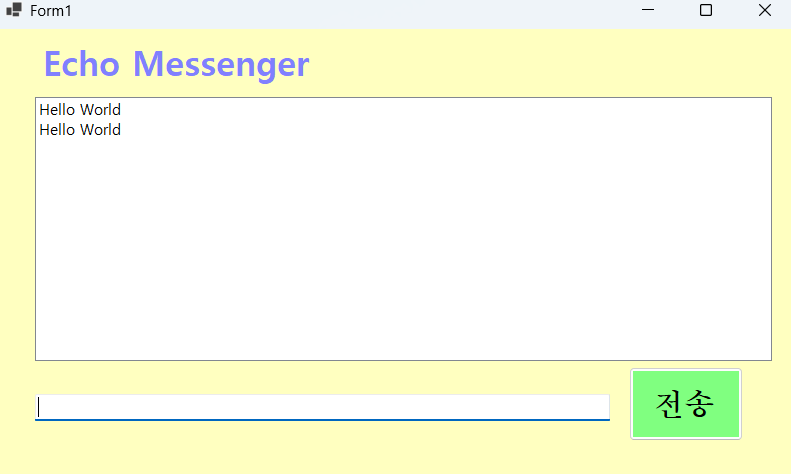
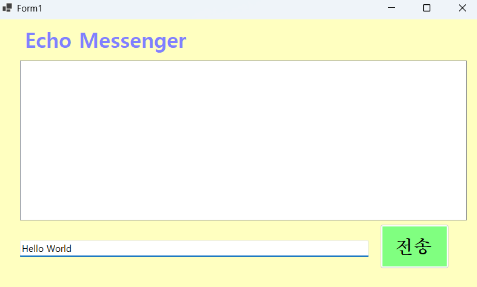
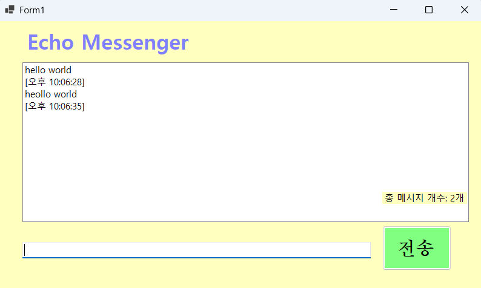
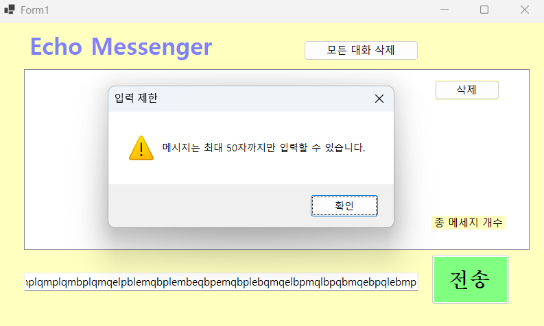

# (C# 코딩) 에코 메신저 ## 개요
- C# 프로그래밍 학습

- 1줄 소개: 사용자가 textbox에 글자를 입력하면 그 위 listbox에 나타나게 처리하는 시스템
- 사용한 플랫폼: 
- C#, .NET Windows Forms, Visual Studio, GitHub
- 사용한 컨트롤:
- Label, TextBox, ListBox, Button
- 사용한 기술과 구현한 기능:
- 
- 
-
- 실습 중에 구현한 기능들 설명
-
-
## 실행 화면 (과제1)
- 과제1 코드의 실행 스크린샷

- 과제 내용
-label과 textbox, linebox, button을 구성
-textbox에 택스트 입력 후 전송 버튼을 누를 경우 lisrbox로 택스트가 저장
-그 후 textbox에 있는 택스트를 clear시킴
- 구현 내용과 기능 설명
- textbox에 택스트를 입력 후 전송 버튼을 누르면 위 listbox로 택스트 이동 후
- 기존 textbox에 있는 택스트는 사라지고 다음 택스트를 준비함

## 실행 화면 (과제2)
- 과제2 코드의 실행 스크린샷
- ## 실행 화면 (과제3)

- 과제 내용
-전송 버튼 클릭 시 택스트박스에 있는 택스트가 리스트박스로 이동 후 택스트상자에있는
택스트들이 clear 되고 다음 택스트를 칠 수 있도록 focus 상태로 만듬
-또한 Enter 키로 전송이 가능하고 택스트상자에 택스트가 없을 시 전송이 불가능하게 만드는
입력 방어 기능을 삽입
- 구현 내용과 기능 설명
- 입력창에 입력된 택스트들을 엔터 키로 리스트박스로 이동이 가능하게 함
- 또한 전송 버튼을 누를 시 택스트박스에 있는 택스트들이 clear되고 다음 택스트를 칠 수 있도록 focus 됨
- 택스트상자에 글자가 없을 시 전송이 불가능하게 되는 입력 방지 기능을 추가함

## 실행 화면 (과제3)
- 과제3 코드의 실행 스크린샷

- 과제 내용
- 텍스트를 작성 시 오른쪽에 현재시각을 출력한다
- 아래 새로운 label에 현재 메세지 개수를 표시한다
- 텍스트박스에 불필요한 스패이스 칸을 없애고 리스트 박스에 채운다
- 구현 내용과 기능 설명
- 택스트 작성 시 오른쪽에 현재 시각을 출력함{tt hh:mm:ss} 형식으로 출력
- label에 지금까지 전송한 메세지의 개수를 표기함

## 실행 화면 (과제4)
- 과제4 코드의 실행 스크린샷

- 과제 내용
- 메세지를 클릭 후 삭제 버튼을 누르면 메세지가 삭제된다
- 대화 기록 삭제를 누르면 모든 대화 기록이 삭제된다
- 입력창에 글자 수 제한을 50으로 두고 그 이상이 되면 경고문이 뜬다
- 구현 내용과 기능 설명
- SelectedIndex로 마우스로 입력된 항목을 특정해 삭제하게 만듬
- 새로운 삭제 버튼을 만들고 대화 기록만 삭제되게 만듬
- message.Length > 50 (메세지 제한 50)으로 설정하고 그 이상 택스트를 치면 메세지 박스가 나오게 만듬